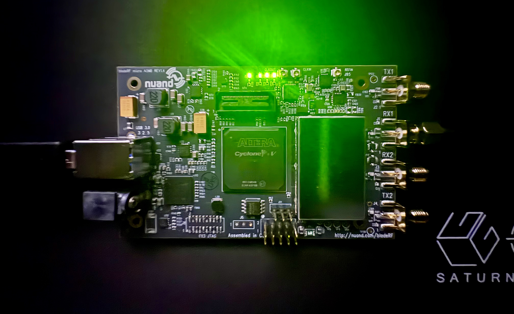

# Metal_SDR

Hardware-agnostic RF signal fingerprinting and classification.

## Current System Overview

**Purpose**: Capture, fingerprint, sense, and classify RF signals using modular SDR backends. Store captures in SigMF format with SQLite manifest. Support modulation classification, spectrum sensing, and cognitive radio applications like dynamic spectrum access.

**Hardware**:
- RTL-SDR: FM broadcast, ADS-B, LoRa (24 MHz - 1.7 GHz, 2.4 Msps)
- BladeRF 2.0: LTE, WiFi, wideband signals (47 MHz - 6 GHz, up to 61.44 Msps)

**Signals**: FM broadcast (current), LTE/WiFi (extensible via fingerprinting modules)

## Architecture

BladeRF-first capture pipeline (RTL-SDR still supported for narrowband tests):

```
┌──────────────────────────────────────────────────────────────────────┐
│                        METAL-SDR PIPELINE                            │
└──────────────────────────────────────────────────────────────────────┘

    ┌──────────────────────────────────────────────────────────────────┐
    │        PHYSICAL LAYER (BladeRF 2.0 Micro / RTL-SDR)              │
    │  • BladeRF 2.0: 47 MHz–6 GHz | up to 61.44 Msps | 12-bit | MIMO  │
    │  • RTL-SDR:    24 MHz–1.7 GHz | 2.4 Msps | 8-bit                │
    └────────┬─────────────────────────────────────────────────────────┘
             │ complex64 IQ stream (hardware-agnostic from here down)
             ▼
    ┌──────────────────────────────────────────────────────────────────┐
    │            CAPTURE MANAGER + BACKENDS                            │
    │  • `batch_capture.py --backend {bladerf,rtlsdr}`                 │
    │  • Configurable freq, sample rate, duration, gain                │
    │  • Writes SigMF pair: .sigmf-data (cf32) + .sigmf-meta (JSON)    │
    └────────┬─────────────────────────────────────────────────────────┘
             │
             ▼
    ┌──────────────────────────────────────────────────────────────────┐
    │                   MANIFEST + INTEGRITY                           │
    │  • `sqlite_logger.py`: captures table + hashes                   │
    │  • BLAKE3 hash stored in meta for tamper detection               │
    └────────┬─────────────────────────────────────────────────────────┘
             │
             ▼
    ┌──────────────────────────────────────────────────────────────────┐
    │                 FINGERPRINTING LAYER                             │
    │  • `fm_fingerprint.py`: PSD, peak freq, CNR, 3 dB BW             │
    │  • `lte_fingerprint.py`: LTE skeleton (OFDM-centric)             │
    │  • Shared helpers in `base_fingerprint.py`                       │
    └───────────────────────────────────────────--─────────────────────┘
```

## Components

### Capture Scripts
- `batch_capture.py`: Hardware-agnostic batch captures with --backend flag (rtl-sdr or bladerf).

### Fingerprinting
- Generalized with `base_fingerprint.py`.
- `fm_fingerprint.py`: FM-specific features.
- `lte_fingerprint.py`: LTE features (skeleton).

### Database and Utils
- `sqlite_logger.py`: Log captures.
- `analyze_captures.py`: Summary statistics.

## Usage

See `docs/PIPELINE.md` for detailed workflows.

### Example: BladeRF Capture and Fingerprint
```bash
python scripts/capture/batch_capture.py --backend bladerf --freq 1.8e9 --sample-rate 20e6
python scripts/fingerprinting/lte_fingerprint.py path/to/capture.sigmf-meta
```

---



---